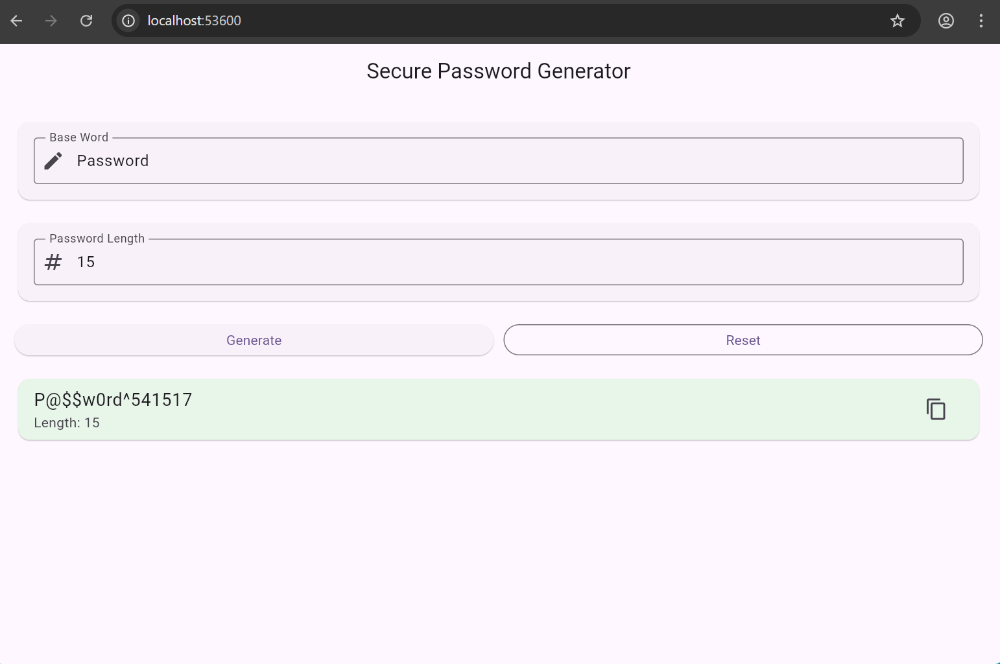

# Secure Password Generator

A modern Flutter application that generates secure, strong, and recognizable passwords from a user-provided base word.

This app transforms a familiar word into a complex password using intelligent character substitutions, symbols, numbers, and customizable length.

---
## Project Overview

Weak or predictable passwords are one of the most common causes of security breaches. This project demonstrates the implementation of a secure password generation mechanism using Python’s secrets module to ensure cryptographic randomness.

The goal of this project is to apply secure coding principles while understanding the importance of entropy, randomness, and password complexity in cybersecurity.

---

## Features

• Generate secure passwords from a base word  
• Leetspeak transformation (example: a → @, e → 3, o → 0)  
• Custom password length  
• Modern and clean UI  
• Copy password to clipboard  
• Reset functionality  
• Cross-platform support (Android, Web, Windows, Linux, macOS)

## How It Works

The password generation process includes:

1. Accepts a base word from the user
2. Applies character substitutions using security transformation rules
3. Adds uppercase letters, symbols, and numbers
4. Adjusts the password to match the exact requested length
5. Produces a secure and recognizable password


---

## Example

Input:
```
Base word: sunshine
Length: 14
```

Output:
```
Sun$h!n3@8
```

Secure, recognizable, and complex.

---

## Built With

• Flutter  
• Dart  
• Material 3 UI  

---

## Project Structure

```
secure-password-generator/
│
├── lib/
│   └── main.dart
│
├── android/
├── ios/
├── web/
├── windows/
├── linux/
├── macos/
│
├── pubspec.yaml
└── README.md
```

---

## How to Run

### Prerequisites

• Flutter SDK installed  
• VS Code or Android Studio  

---

### Steps

```
flutter pub get
flutter run
```
## Preview



---

## Purpose

This project demonstrates:

• Flutter UI development  
• Password generation logic  
• Secure password practices  
• Cross-platform mobile and desktop development  

---

## License

This project is intended for educational purposes.


